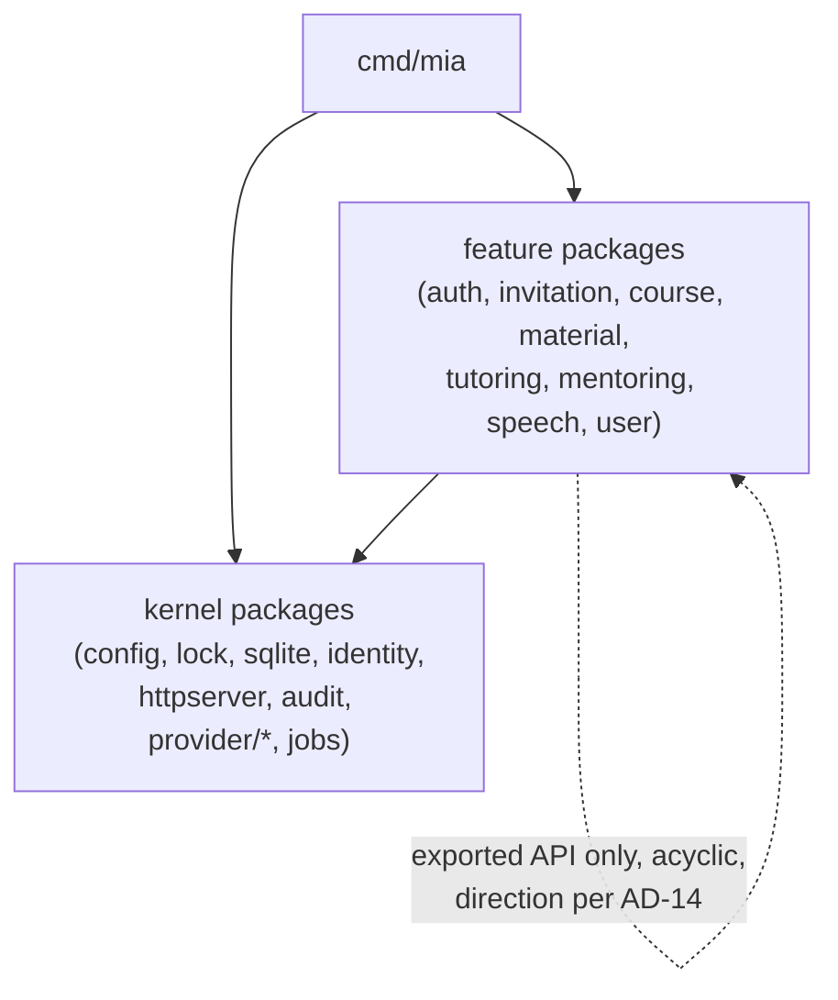
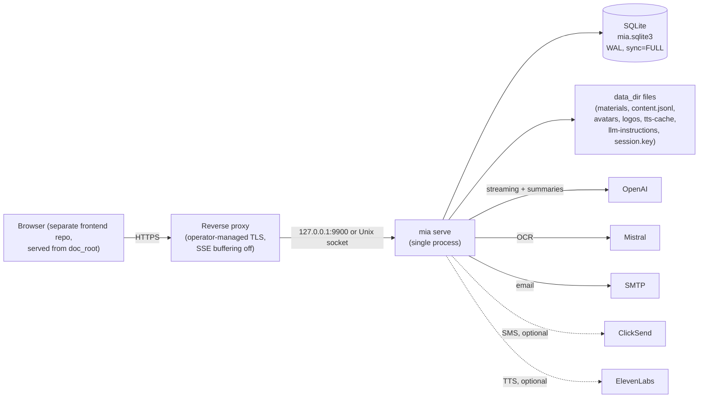

# Architecture Spine — MIA backend MVP

## Design Paradigm

**Vertical feature packages over a thin shared kernel.** Each bounded feature is one Go package under
`internal/` owning its HTTP handlers, domain logic, SQL, and tables. The kernel (`config`, `lock`, `sqlite`,
`identity`, `httpserver`, `audit`, `provider/*`, `jobs`) supplies cross-cutting machinery and never contains
feature logic. Features are added only when implemented — no speculative domain tree. The API is built as
complete vertical slices; the authentication/session family is the first slice.

## Invariants & Rules

### AD-1 — Vertical feature packages, thin kernel

- **Binds:** all
- **Prevents:** horizontal-layer sprawl (shared `handlers/`/`service/`/`store/` trees) and speculative
  hexagonal ceremony
- **Rule:** one package per bounded feature owning its handlers, domain logic, and SQL; cross-cutting machinery
  lives only in kernel packages; a feature package is created in the same change that implements it.

### AD-2 — Dependency direction

- **Binds:** all
- **Prevents:** import cycles and kernel→feature coupling
- **Rule:** `cmd/mia` may import anything. Feature packages may import kernel packages and other feature
  packages' exported APIs; the import graph across feature packages must stay acyclic. Kernel packages never
  import feature packages.



### AD-3 — Strict table ownership and transaction boundaries

- **Binds:** all persistence
- **Prevents:** invisible cross-feature table coupling; two owners of one entity; orphaned transaction contracts
- **Rule:** every table has exactly one owning feature or kernel package; other packages reach that data only
  through the owner's exported Go API — never direct SQL against foreign tables. A documented multi-feature
  operation (e.g. invitation acceptance creating account + roles) runs in one transaction: the initiating
  operation owns the transaction and passes it into the owning packages' functions. The `sqlite` kernel defines
  the single transaction/querier type that every exported owner function accepts — no per-package querier
  interfaces.

### AD-4 — Authorization-scoped fetch

- **Binds:** all resource access (FR-level authorization, NFR-1, NFR-2)
- **Prevents:** existence leaks and fetch-then-check drift across slices
- **Rule:** resources are reachable only through fetch functions that take the acting user's context and apply
  action + role + course assignment + student assignment + ownership + resource state. Missing and out-of-scope
  return the identical not-found result. Handlers never fetch first and authorize second. A model tool request
  never grants access; retrieval passes through the same scoped fetch.

### AD-5 — Three work-execution systems, never interchanged

- **Binds:** material processing, summaries, tutor responses, speech (FR-48, FR-60..64, FR-72..73, FR-83..84)
- **Prevents:** routing interactive streaming or speech through the durable job queue, or inventing a fourth
  mechanism
- **Rule:** exactly three execution systems exist. (1) Jobs table: OCR extraction, material summary, session
  summary — durable queue, 2-minute lease with 30-second renewal, ≤3 attempts; shutdown/expired-lease requeue
  only while attempts remain (an interrupted attempt stays counted), otherwise the subject's terminal-failure
  transition runs in the same transaction as the failed job state. No generic job retry exists; the only retry
  paths are the domain actions of material re-finalization and session-summary regeneration.
  (2) Tutor-response manager: in-memory, SSE subscribers, persistence batches every 16 KiB or 1 second
  and always before terminal commit, cancel-and-fail on shutdown, stranded generating → failed on startup.
  (3) Speech cache lifecycle: generating/available/failed record, concurrent requests share one generation,
  explicit retry only. Tutor responses and speech never become jobs-table jobs. Job rows carry queryable
  `subject_type`/`subject_id` columns (never subject references buried in payload JSON); feature packages
  register per-job-type handlers at `cmd/mia` wiring; the worker invokes the handler's terminal-failure
  transition with the open transaction; `jobs` exports delete-by-subject for lifecycle cascades (AD-14).

### AD-6 — Guarded-commit discipline (shared by all three systems)

- **Binds:** all asynchronous result commits and destructive operations (FR-78)
- **Prevents:** resurrecting deleted data; duplicate durable output; workers coordinating with deletions
- **Rule:** every asynchronous result commits via a lease- or state-guarded UPDATE of existing rows. A zero-row
  result means the target is gone or stale: discard the result, remove files newly published by that attempt,
  and stop — never upsert, requeue, or re-issue the provider request. Destructive operations never wait for
  in-flight work.

### AD-7 — One error registry, one mapping layer

- **Binds:** all error handling
- **Prevents:** per-slice error shapes; retryability decisions scattered through call sites
- **Rule:** one shared domain-error type carries a stable machine code from a single registry that also supplies
  audit failure codes and sanitized restart/failure codes. Errors wrap with `%w`, preserving identity. Exactly
  one mapping layer in `httpserver` translates domain errors to JSON:API error objects and status codes;
  handlers never build error responses by hand. Provider errors are classified retryable/permanent at the
  adapter boundary only.

### AD-8 — Stateless sessions, per-request state reload `[ADOPTED]`

- **Binds:** all authenticated routes (FR-22..25, NFR-2)
- **Prevents:** trusting cookie contents; per-slice session handling
- **Rule:** one signed+encrypted CookieStore cookie holds only user ID, login stage, challenge ID, security
  generation, and timers. Account, role, assignment, ban, and password-gate state are reloaded from SQLite on
  every request. Security-generation mismatch clears the cookie and rejects. Stage transitions rotate the
  cookie; restricted stages allow only their enumerated actions. The reload runs through a mandatory
  authenticated-route registration path in `httpserver` with an identity loader injected at wiring — no feature
  registers an authenticated route any other way; routes declare their required stage, defaulting to full
  `authenticated`, and only `auth` may register `mfa`/`password-change`-stage routes. The security generation is
  bumped only through `user`'s single exported function, and only by: supervisor temporary-password set (FR-19),
  student MFA reset (FR-32), staff MFA reset (FR-32), and `reset-admin-mfa`. Explicit non-triggers: self
  password change or reset (FR-20), staff mobile change, and ban/unban (bans act via per-request state reload).

### AD-9 — SQLite access contract `[ADOPTED]`

- **Binds:** all persistence
- **Prevents:** divergent connection/migration handling per command
- **Rule:** CGo-free `modernc.org/sqlite`; fixed `data_dir/mia.sqlite3`; WAL, `synchronous=FULL`, foreign keys
  on, 5-second busy timeout; pool of 4 open / 4 idle, no reader/writer split. Every DB-using command acquires
  the exclusive `mia.lock` OS lock before opening SQLite, then applies embedded forward-only `golang-migrate` v4
  migrations; dirty or newer-than-executable schema refuses to run.

### AD-10 — Provider adapter contract `[ADOPTED]`

- **Binds:** `provider/*` (openai, mistral, smtp, clicksend, elevenlabs)
- **Prevents:** raw provider payloads leaking; ad-hoc timeouts and retries per call site
- **Rule:** adapters allowlist request, response, stream, and usage fields; missing or malformed required
  structures fail safely; raw payloads are never retained or exposed. Each provider's fixed deadlines live in
  its adapter. Request-path calls never auto-retry after ambiguous failure; only the jobs system retries, per
  its policy. Startup validates provider configuration locally and never calls a provider. The durable SMS
  send-limit state (60-second cooldown, 5/hour, 10/day per account and per destination) is one kernel-owned
  table beside `provider/clicksend`; every SMS-sending path reserves through its exported gate inside its own
  transaction — no feature keeps a private counter.

### AD-11 — File publication and startup integrity `[ADOPTED]`

- **Binds:** all data-directory writes (NFR-14, NFR-15)
- **Prevents:** DB/file divergence; automatic repair hiding corruption
- **Rule:** files publish by atomic rename to ID-derived deterministic paths before or with their DB commit;
  failed commits remove published files. Deletion makes DB rows unreachable first (one transaction), then
  removes files synchronously best-effort; surviving orphans are tolerated and removed by startup
  reconciliation. Startup order: delete expired speech → fail stranded speech and tutor
  generation (removing incomplete output, never re-issuing provider requests) → exit fatally when the DB
  references a missing source file, `content.jsonl`, or unexpired available speech file → reconcile orphans.
  Missing avatars/logos are normal (path presence = availability). One shared kernel file-publication helper
  implements this contract, added with the first file-writing slice; every file-writing feature uses it — the
  temp-placement/fsync strategy stays deferred, its ownership does not.

### AD-12 — Audit in the mutating transaction `[ADOPTED]`

- **Binds:** all audited operations (FR-79..80)
- **Prevents:** audit drift from its mutation; content leaking into audit
- **Rule:** audit events are written by the shared `audit` kernel package inside the same transaction as the
  mutation they record, using stable dotted action names from the AD-7 registry, content-free, with random
  one-way fingerprints for deleted subjects. Only `audit` generates deletion fingerprints, via its exported
  function returning one stable random value per deleted identity within a deletion operation; callers never
  hash or invent their own. Denied ordinary reads are not audited.

### AD-13 — Account-record ownership

- **Binds:** `user`, `auth`, `invitation`, `course`, `cmd/mia` (FR-6..17, FR-74..77)
- **Prevents:** two owners of `users`/`user_roles`; three account-creation flows inventing three creation shapes
- **Rule:** `user` ships in the same change as `auth` (the first slice delivers both packages). `user` owns
  `users`, `user_roles`, and the account security-state columns (security generation, `must_change_password`,
  ban state). `auth` owns only credential-flow tables (login/MFA challenges, factors, recovery-code digests,
  reset challenges, MFA-management proofs). Exactly one account-creation function and one idempotent role-grant
  function exist, exported by `user` and covering all three creation shapes (invited staff, provisioned student,
  bootstrap administrator) including initial roles; `invitation`, `course`, and `cmd/mia` call them inside their
  own transactions. `cmd/mia` never issues feature SQL.

### AD-14 — Lifecycle registry and canonical import direction

- **Binds:** all feature packages (FR-42, FR-43, FR-70, FR-76..78)
- **Prevents:** cascade deletion forcing `course`/`user` to import the packages that import them — a jointly
  unbuildable cycle
- **Rule:** canonical import direction: `material`, `tutoring`, `mentoring`, `speech` may import `course` and
  `user`; `course` may import `user`; never the reverse. Cascading deletion inverts through a small kernel
  lifecycle registry: feature packages implement narrow course-scoped and account-scoped deletion interfaces
  (account-scoped covers data deletion, open-work triage, and historical actor-reference clearing) and register
  them in `cmd/mia` wiring; `course` and `user` own the deleting transaction and invoke every registered
  deleter inside it.

## Consistency Conventions

| Concern | Convention |
| --- | --- |
| IDs | Prefixed UUID v4 TEXT primary keys (`u_`, `cou_`, `mat_`, `ts_`, `job_`, `aud_`, …); IDs are opaque and never authorize |
| Instants | RFC 3339 UTC, `Z` suffix, exactly 6 fractional digits persisted/returned; accept ≤9 on input |
| API shape | JSON:API under `/api/v1`; plural kebab-case types, snake_case attributes; non-JSON:API only for uploads, downloads, audio, SSE |
| Uniqueness keys | ASCII lowercase for username/email; `cases.Fold`+NFC for course/material names; no SQLite `NOCASE` |
| SQL | Parameterized only; booleans as 0/1 integers; enums via CHECK; JSON columns validated before write |
| Text handling | CRLF/CR→LF, trim, reject NUL/controls (except tab/newline) — never for passwords or chat messages |
| Go flow | `context.Context` through request, DB, job, and provider paths; no mutable globals beyond wiring; close owned resources on every path |
| Credentials | Passwords hashed with fixed-parameter Argon2id; bearer tokens (invitation, reset) and MFA-management proofs are canonical lowercase UUID v4 persisted only as SHA-256 digests. MVP deliberately stores TOTP secrets and active SMS codes plaintext (NFR-5) — no slice adds ad-hoc field encryption |
| Redaction | Never log or audit passwords, hashes, MFA values, tokens, cookies, credentials, prompts, message bodies, provider payloads; secrets via TOML/env only |
| Emailed links | Built only from the configured `main.public_url` HTTPS origin — never derived from request or forwarded headers |
| Data directory | Directories 0700, files 0600, no group/other permission bits; uploaded/generated files never inside the static document root |
| Errors | Wrap with `%w`; no blank-identifier swallowing; panic only for true internal invariant violations |
| Logging | One shared structured logger from the kernel (json/text per `[log]` config, level discipline, SIGHUP reopens the file); no per-feature loggers; no health/metrics endpoints in the MVP |
| Rate limiting | `httpserver` exports named limiter definitions (dimensions, window, attempts-vs-failures counting); features reference by name and pass raw values; the limiter canonicalizes (usernames via `identity`, tokens as digests, IPs from the trusted-proxy resolver) |
| Request-ID idempotency | `request_id` plus SHA-256 canonical-body digest columns on the owning row (retention follows the data per AD-3); replay matches by digest, mismatch returns the one registry conflict code; natural-key idempotency (FR-13, FR-16) is a separate pattern and never uses request IDs |
| Name normalization | One kernel function (`identity`) produces the `cases.Fold`+NFC uniqueness key for course and material names; features never implement their own |
| Registry naming | Audit actions `<package>.<entity>.<verb>` dotted past tense; error codes `<package>_<condition>` snake_case; the registry rejects additions that break the scheme |
| API query grammar | Pagination, includes, filters, and sorting follow the conventions section of `docs/api.md` (offset `page[limit]`/`page[offset]`, per-route allowlists, validation errors for unknown params) until a slice contract supersedes it explicitly |
| Testing | Real embedded migrations in SQLite integration tests; provider behavior via local fakes/`httptest`; never call paid providers; no `t.Parallel()` over shared state |
| Verification | `gofmt`, `go test ./...`, `go vet ./...`, `golangci-lint run ./...` after changes |

## Stack

| Name | Version |
| --- | --- |
| Go | ≥ 1.27.0 (module `github.com/thorstenkramm/mia`) |
| Echo | 5.3.1 |
| modernc.org/sqlite | current at implementation |
| golang-migrate | v4 (library, embedded migrations) |
| echo-contrib/v5/session (Gorilla CookieStore) | v5.x current at implementation (the v0.x contrib line targets Echo v4) |
| tiktoken-go/tokenizer | current; `o200k_base` — model→tokenizer mapping verified at adapter implementation, unsupported mapping is a startup error |
| golang.org/x/text | current (BCP 47, `cases.Fold`) |
| SecLists common passwords | top-100k, embedded, version recorded on addition |
| OpenAI models | `gpt-5.6-terra` default chat/job (operator-configurable, Responses API + function calling) |
| Mistral OCR | fixed `mistral-ocr-4-1` |

## Structural Seed

```text
mia/
  cmd/mia/            # main: subcommand wiring only (serve, bootstrap-admin, reset-admin-mfa)
  internal/
    config/           # TOML/env/flag precedence, strict validation, permission checks
    lock/             # mia.lock exclusive OS lock
    sqlite/           # driver setup, embedded migrations, tx helpers
    identity/         # username/email/password/BCP47/country/tz/E.164 validation
    httpserver/       # Echo wiring, sessions, CSRF, rate limiting, client-IP trust,
                      #   static serving, JSON:API error mapping (the HTTP kernel)
    audit/            # audit event writes (same-tx); arrives with the first
                      #   audited slice (auth)
    lifecycle/        # deletion registry (AD-14); arrives with the first
                      #   cascading-deletion slice
    auth/             # first vertical slice: login stages, MFA, recovery
    user/             # ships with auth (AD-13): accounts, roles, security state
    provider/         # added with the first slice needing each adapter:
                      #   openai, mistral, smtp, clicksend, elevenlabs
    jobs/             # added with the material slice: jobs-table worker, leases
                      # further feature packages added with their implementation:
                      #   invitation, course, material, tutoring, mentoring,
                      #   speech
  migrations/         # embedded numbered SQL (forward-only)
```



### Operational envelope

- Backup/restore: SQLite plus the data directory (including `session.key`) form one consistent data set, backed
  up and restored together by the operator; MIA offers no backup tooling, and anyone with backup access is fully
  trusted (NFR-5, NFR-14).
- Upgrade: stop the server, replace the binary, start; migrations apply forward-only on start; dirty or
  newer-than-executable schema refuses to run (AD-9); `mia.lock` prevents process overlap. No rollback tooling.
- Environments: one self-hosted production instance per operator; no dev/test/prod machinery ships in the
  binary. Tests run against temporary data directories with real migrations.
- Observability: structured logs only (see Logging convention); no health, metrics, or tracing endpoints in the
  MVP; job state and audit log are inspected through the authenticated API.

## Capability → Architecture Map

| Capability / Area | Lives in | Governed by |
| --- | --- | --- |
| Identity & account data (FR-1..5) | `identity`, `user` | AD-3, conventions |
| Invitations & roles (FR-6..14) | `invitation`, `user` | AD-3, AD-4, AD-12 |
| Student provisioning & membership (FR-15..17) | `course`, `user` | AD-3, AD-4 |
| Auth sessions, passwords, recovery (FR-18..25) | `auth` | AD-7, AD-8 |
| MFA (FR-26..32) | `auth` | AD-7, AD-8, AD-12 |
| Profiles, avatars, mobile (FR-33..36) | `user` | AD-3, AD-4, AD-11 |
| Courses & memberships (FR-37..44) | `course` | AD-3, AD-4, AD-6 |
| Material & processing (FR-45..53) | `material`, `jobs`, `provider/mistral` | AD-5, AD-6, AD-11 |
| Tutoring sessions & streaming (FR-54..64; NFR-12 fixed 32k/2k budgets) | `tutoring`, `provider/openai` | AD-4, AD-5, AD-6 |
| Mentoring (FR-65..71) | `mentoring` | AD-3, AD-4 |
| Text-to-speech (FR-72..73) | `speech`, `provider/elevenlabs` | AD-5, AD-6, AD-11 |
| Bans, deletion, lifecycle (FR-74..78) | `user`, `course` | AD-3, AD-6, AD-8 |
| Audit (FR-79..80) | `audit` | AD-12 |
| Time & localization (FR-81) | conventions (Instants), `identity`, `user` | conventions |
| No workflow notifications (FR-82) | — (negative requirement) | no slice adds notification behavior |
| Rate limiting & abuse (NFR-9..11) | `httpserver` | AD-8, conventions |
| Input bounds & untrusted input (NFR-3, NFR-13) | all packages | AD-10, conventions |
| Jobs oversight (FR-83..84) | `jobs` | AD-5, AD-6 |
| Local commands (FR-7, FR-32) | `cmd/mia`, `lock`, `sqlite` | AD-9, AD-13 |

## Deferred

- Per-route API contracts (attributes, writable fields, filters, status codes, idempotent replay details) —
  defined per vertical slice, auth first; `docs/api.md` is the draft.
- The error-code catalog contents — the registry (AD-7) is fixed; codes are added per slice.
- Provider adapter contracts (exact fields, streaming events, retryable classes) — written against the live
  provider API at each adapter's implementation.
- CSP for static serving — resolved 2026-08-29: a strict baseline CSP ships with static serving (NFR-8),
  loosened during frontend integration only when the frontend demonstrably requires it.
- Temporary-file placement and fsync/directory-sync strategy — specified with implementation inside the single
  kernel file-publication helper (AD-11 fixes the contract and the ownership).
- Material-brief per-field limits — resolved 2026-08-29: defined in FR-49 of the adopted PRD.
- Whether tutor-response and speech work appear in `GET /jobs` — an API-contract question (PRD §13, addendum
  tensions); AD-5 fixes the execution split either way.
- `GET /tutoring-sessions/{id}/materials` semantics (used vs selected; per-role visibility), the SSE state for
  never-started queued responses, and the `GET /users` visibility shaping for three audiences — API-contract
  questions from the PRD addendum; AD-4 governs whichever shape is chosen.
- Feature-internal file layout within a package — the owning implementer's call; AD-1..AD-3 bound it.
- Echo patch level within 5.x and exact `modernc.org/sqlite`/`modernc.org/libc` co-pins — a deliberate choice at
  `go.mod` creation.
